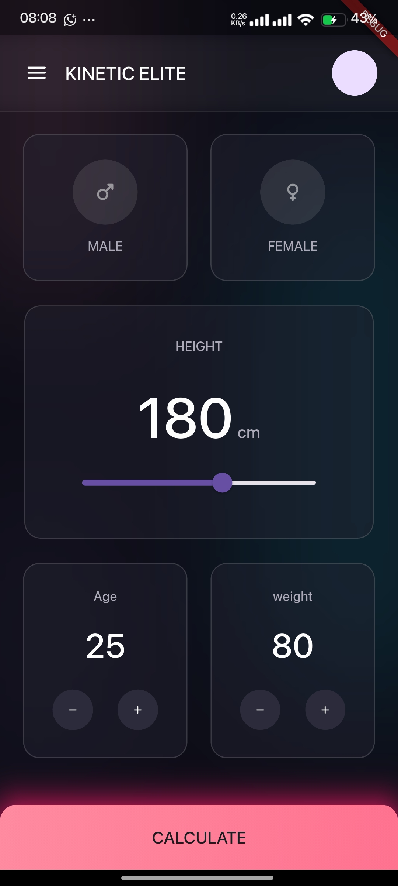

# <p align="center">  </p>

# <p align="center"> ⚡ KINETIC ELITE ⚡ <br> `Cross-Platform Body Metrics Analysis Suite` </p>

<p align="center">
  
  
  
  
  
</p>

---

## 🎨 The Soul of the Project

**"Kinetic Elite"** isn't just another generic BMI calculator. It's born from a passion to merge sleek, modern user interfaces with hyper-accurate physiological data interpretation.

We built this for individuals who don't just want to see a number, but want to *feel* their data. Every interaction is designed to be kinetic, fluid, and intuitive. This application provides a sophisticated snapshot of key body metrics, leveraging a custom hybrid backend approach.

---

## 📸 Inside Kinetic Elite

### A Unified, Dark-Mode First Experience

We obsess over the user experience. The entire interface is optimized for performance and aesthetics, featuring a custom dark theme that reduces eye strain while looking sophisticated.

<p align="center">
  
  <br>
  <em>Figure 1: The main interface showcasing metric inputs. Note the subtle gradients and the specialized neon-pink 'CALCULATE' interaction target.</em>
</p>

#### Core Features (As seen in UI):

* **⚡ Intuitve Gender Selection:** Smooth, distinct male/female toggles with precise iconography.
* **📏 Kinetic Height Control:** An interactive slider offering real-time centimeter (cm) feedback, designed for fine-grained input.
* **⚖️ Dynamic Metric Tuning:** Specialized plus/minus control widgets for Age and Weight, allowing precise, single-unit adjustments.

---

## 🛠️ The Tech Stack: A Deep Dive into Hybrid Engineering

This is where "Kinetic Elite" gets serious. We aren't just relying on Flutter's beautiful frontend; we are leveraging the raw power of **Native Interoperability** to ensure precision and future-proof scalability.

### Frontend: The Flutter Canvas

We chose Flutter and Dart for their unparalleled ability to deliver silky-smooth, custom-rendered UIs across both Android and iOS from a single codebase.
* **Core UI:** Custom-built Widgets for the height slider and input controls.
* **State Management:** [Mention your choice here, e.g., BloC or Provider - e.g., We use the BloC pattern to ensure predictable state propagation.]

### Backend Logic: The Native C++ Engine

**Why C++ for a BMI calculator?**
While the formula is simple, this app is the *foundation* for a wider physiological analysis suite. We are routing the core metric calculation through a native **C++ shared library**. This provides:

1.  **🚀 Raw Performance:** Native code execution for future complex algorithm integration.
2.  **🔬 Reusability:** The same math engine can be used in other native projects.
3.  **🔗 Flutter FFI:** We utilize Dart’s **Foreign Function Interface (FFI)** to bridge the Dart UI with our high-performance C++ backend.

---

## 📁 Project Architecture

We believe in clean code and a modular structure that reflects our hybrid approach. We explicitly focus *only* on the mobile ecosystem (Android/iOS) to optimize build size and developer focus.

```text
kinetic_elite/
├── android/          # Optimized Android native configurations
├── cpp/              # The heart of the calculation engine (Shared Library source)
├── ios/              # Flutter-integrated Xcode project
├── lib/              # The Flutter Dart UI application source
│   ├── main.dart     # App entry point
│   ├── widgets/      # The custom cards, sliders, and buttons
│   └── bridge/       # FFI bindings to talk to the C++ code
└── test/             # Comprehensive testing suite